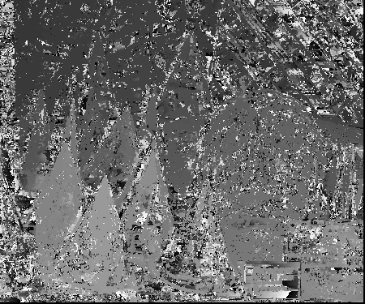
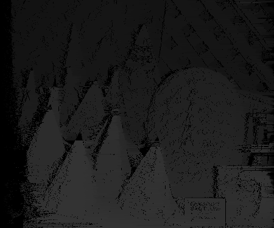

# task1
## Stereo reconstruction

## 1. Prerequisites

1.1. **OpenCV**
- [OpenCV 3.4](https://github.com/opencv/opencv/tree/3.4)

1.2. **Eigen**
- sudo apt install libeigen3-dev

1.3. **Pangolin** 
- [Pangolin](https://github.com/stevenlovegrove/Pangolin)

## 2. Build the project
```
mkdir build && cd build && cmake .. && make -j 
./OpenCV_stereo ../data/view0.png ../data/view1.png ../data/result1

```

## 3. Test dataset

3.1 dataset
- [middlebury](https://vision.middlebury.edu/stereo/data/)

3.2 result
- naive approach

- dynamic approach



## 4. coding style
- We use [Google C++ coding style guide](https://google.github.io/styleguide/cppguide.html)
- We use Google-format(.clang-format)
