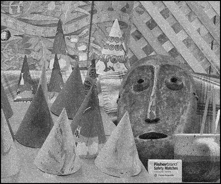
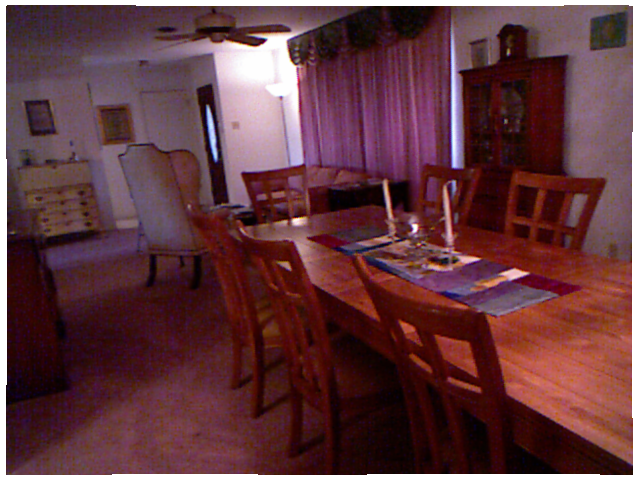
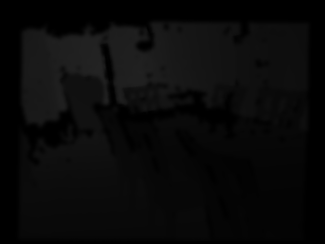

# task2
## image filter

## 1. Prerequisites

1.1. **OpenCV**
- [OpenCV 3.4](https://github.com/opencv/opencv/tree/3.4)


## 2. Build the project
```
mkdir build && cd build && cmake .. && make -j 
./OpenCV_stereo ../data/1.png ../data/1.pgm

```

## 3. Test dataset

3.1 dataset
- [middlebury](https://vision.middlebury.edu/stereo/data/)

3.2 result

- result of bilteral filter

result 1            |  result 2
:-------------------------:|:-------------------------:
  |  

- result of guided filter

input           |  result 
:-------------------------:|:-------------------------:
  |  

## 4. coding style
- We use [Google C++ coding style guide](https://google.github.io/styleguide/cppguide.html)
- We use Google-format(.clang-format)
